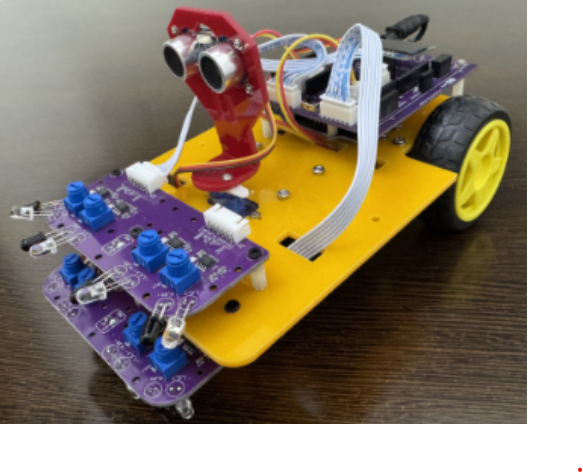

# ZAS Robotics Navigational Robot Car-1 (Sensors Edition)

## About This Product
The **ZAS Robotics Navigational Robot Car-1 (Sensors Edition)** is a classroom-ready autonomous robotics learning platform designed to introduce students to sensor-based navigation, embedded systems, and intelligent behaviour in robots.

Built on the **ZAS Creative Motion Controller + Arduino**, Car-1 combines:
- Ultrasonic distance sensing  
- Downward & forward IR sensing  
- Servo-based scanning  
- Dual DC motor drive using TB6612  
- Real-time navigation algorithms  

This makes Car-1 a complete hands-on system for understanding how robots **perceive, think, and move** in real environments.

## What Students Learn
Car-1 provides a clear, practical introduction to autonomous robotics concepts:

### 🔹 Robotics Perception
- Obstacle detection using ultrasonic + IR  
- Pit / edge sensing using downward IR  
- Wall & object detection  
- Line & floor contrast behaviour  

### 🔹 Motor & Motion Control
- Differential drive control (left/right motors)  
- PWM-based speed modulation  
- Forward, reverse, turning & rotation  

### 🔹 Navigation & Algorithms
- Obstacle avoidance  
- Line interaction  
- Pit/edge avoidance  
- Wall following (internal & external)  
- Left–center–right ultrasonic scanning for path selection  

### 🔹 Embedded Systems Skills
- Connecting and reading sensors  
- Driving motors via TB6612 driver  
- Servo control for environmental scanning  
- Writing structured robot logic in Arduino  
- Debugging and improving robot behaviour  

## Ideal For
- Schools & STEM education programs  
- Engineering and polytechnic colleges  
- Robotics & AI laboratories  
- Maker spaces & innovation hubs  
- Robotics clubs and competitions  
- Self-learning robotics enthusiasts  

Car-1 is **simple enough for beginners**, yet powerful and extensible for advanced experiments — making it one of the most complete educational robotics platforms in its class.
